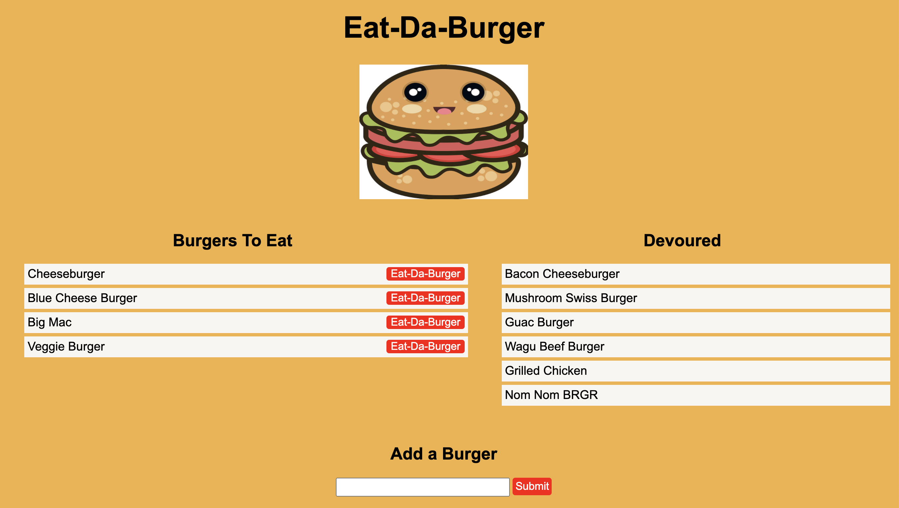

# Burger

A burger logger to keep track of all the burgers to be devoured! When the burger has been eaten, click the button to move burger from the "Burgers to Eat" column to the "Devoured" column.

## Test it out [here](https://fathomless-tundra-95725.herokuapp.com/)

Add the burger name to input box at the bottom of the page and then click the "Submit" button. It will then be added to your "Burgers to Eat" list. Once you have enjoyed the burger, click the "Eat-Da-Burger" button to move it to the "Devoured" list.

## Technologies

- Handlebars
- Node
- Express
- MySQL
- CSS
- ORM
- Heroku

